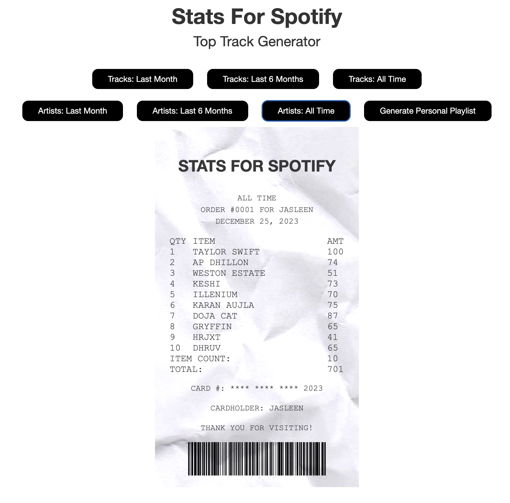
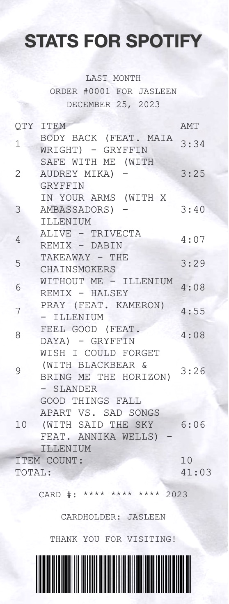
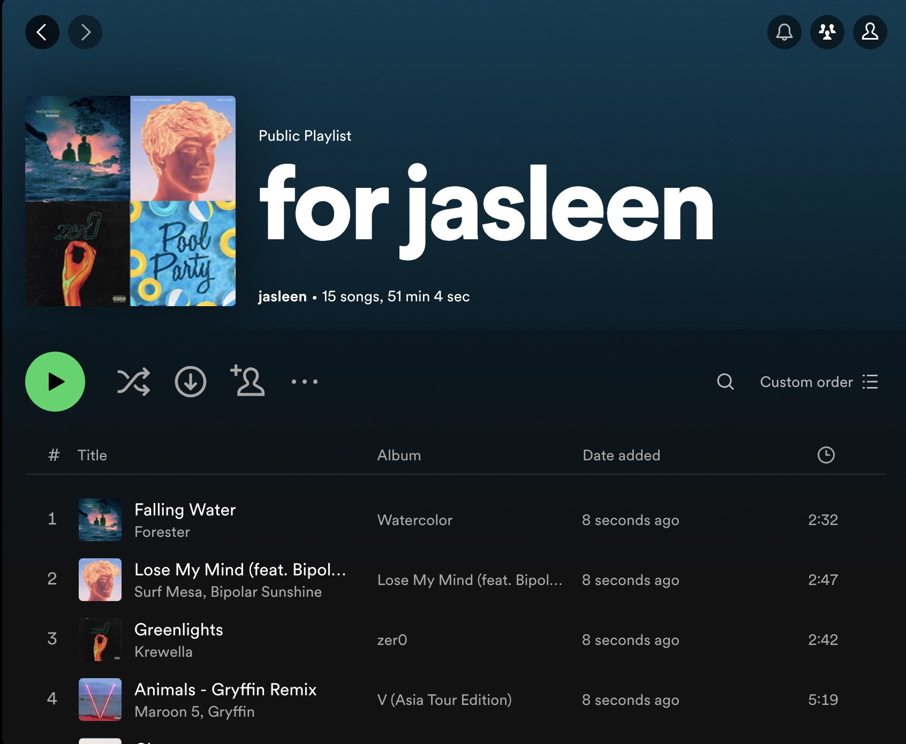

# Stats For Spotify

A Flask web application that gathers a user's Spotify data. Using this, receipts of the user's top tracks and artists are generated, as well as a playlist of recommended songs!

## Demo

